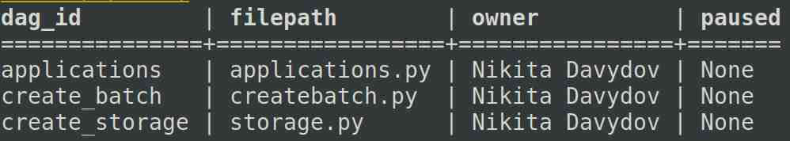
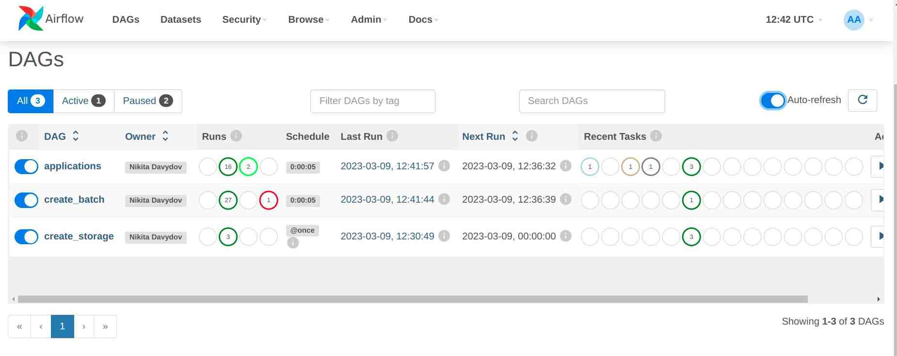

## Airflow pet-project
#### Задача:
Создать ETL-процесс, который получал бы персональные данные лица из источника, обрабатывал их и загружал в DataWarehouse.

1. Имитация API. Генерация персональных данных лица, обращающегося за услугой. Данные хранятся в отдельной папке ***api*** в формате JSON случайным объемом (batch): от 1 до 10 заявок. Данные генерируются с использованием модулей ***random*** и ***fake***. 
	Непосредственно генерация данных ***utils/person.py***. Создание батча ***utils/createbatch.py***.

2. DAG ***create_storage*** создает базу данных dw в PostgreSQL , создает пользователя user1, создает таблицу request, наделяет пользователя правами CRUD на эту таблицу. 

3. DAG ***create_batch*** генерирует каждые 5 секунд батчи - данные, указанные в п.1 

4. DAG ***applications*** осуществляет ETL-процесс:
	- извлекает данные из источника. В моем случае ***api/api.json***,
	- с помощью regexp приводит телефонные номера к последовательности из 10 цифр,
	- с помощью PostgresHook записывает все данные в таблицу ***request***.
	Запланированный интервал выолнения DAGа - 5 секунд.

#### Установка
Для работы необходимо определить переменные среды с паролями, а также домашнюю папку Airflow. 

Домашняя папка ***airflow***

`export AIRFLOW_HOME=$(pwd)`

Пароль супер-пользователя. Необходм для перезагрузки процесса ***postgresql*** в системе инициализации systemd.

`export SUDO_PASSWORD=your_password`

Пароль пользователя postgres. Необходим для создания хранилища ***dw***, таблицы ***request***, создание пользователя, если такого не существует и наделения его соответствующими привилегиями для управления таблицей ***request***

`export PGPASSWORD=postgres_user_password`

Пароль пользователя БД (см. выше)

`export DB_USER_PASSWORD=mypass`

Пароль для администратора web-сервиса ***airflow*** 

`export ADMIN_PASSWORD=admin`

#### Один из возможных вариантов установки:

Клонируем репозиторий и заходим в папку проекта

`cd airflow_pet/`

Создаем виртуальное окружение

`python -m venv .airflow`

Активируем его

`source .airflow/bin/activate`

Устанавливаем необходимые библиотеки

`pip install -r requirements.txt`

Определяем переменную среды AIRFLOW_HOME

`export AIRFLOW_HOME=$(pwd)`

Инициализируем Airflow Backend

`airflow db init`

Создаем пакет

`python setup.py install`

Определяем переменную среды - пароль для пользователя user1 в БД. Необходимо для авторизации в СУБД

`export DB_USER_PASSWORD=user_password`

Определяем переменную среды SUDO_PASSWORD - пароль для суперпользователя. Необходимо для перезагрузки процесса postgresql.

`export SUDO_PASSWORD=your_sudo_password`

Создаем администратора Airflow с логином admin и соответствующим паролем:

`export ADMIN_PASSWORD=admin`

`airflow users  create --role Admin --username admin --email admin --firstname admin --lastname admin --password $ADMIN_PASSWORD`

Проверим наличие нужных дагов. Отключаем примеры. Для этого заходим в конфигурационный файл ***airflow.cfg*** и устанавливаем значение ***False*** для следующей переменной

`load_examples = False`

В терминале вводим

`airflow dags list`

Результат должен быть таким

Тестируем даг ***create_batch***

`airflow dags test create_batch`

Тестируем даг ***create_storage***. Для этого необходимо определить переменную среды ***PGPASSWORD*** для пользователя ***postgres***

`export PGPASSWORD=postgres_user_password`

Тестируем даг ***applications***. Для этого необходимо установить ***хук*** для ***PostgreSQL***. Запускаем веб-сервер на любом порту.

`airflow webserver --port 8080` 

Проходим по соответствующем адресу (localhost:8080), авторизуемся с соответствующим логином и паролем указанном при создании администратора. Во вкладке ***admin*** нажимаем на ***connections***, создаем новое подключение и вводим следующие значения:

- Connection Id: postgreSQL_my1
- Connection Type: Postgres
- Host: localhost
- Schema: dw
- Login: user1
- Password: db_user_password (переменная окружения DB_USER_PASSWORD)
- Port: 5432

Тестируем подключение, а затем сохраняем его. Останавливаем веб-сервер (необходимо в связи с переменными окружения, которые мы ранее установили). Далее проверяем Даг 
***create_storage*** 

`airflow dags test create_storage`

После того как была создана соответствующая схема БД ***dw***, а также пользователь ***user1*** тестируем Даг ***applications***

`airflow dags test applications`

Запускаем планировщик, а затем и веб-сервер.

`airflow scheduler`

`airflow webserver --port 8080`

